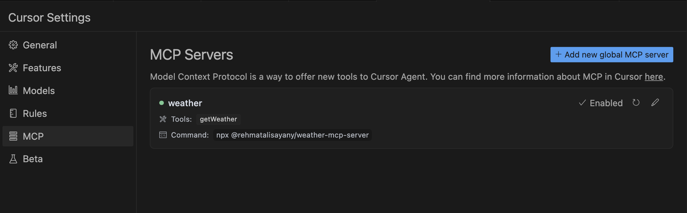
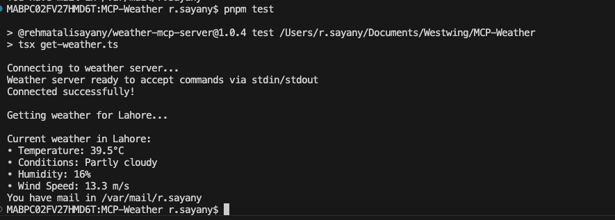

# Weather MCP Server

A Model Context Protocol (MCP) server for fetching weather data using the Open-Meteo API. This server can be integrated with Cursor IDE to provide weather information through the MCP protocol.

## Usage

### As a CLI Tool

```bash
npx @rehmatalisayany/weather-mcp-server
```

### In Cursor IDE

Add the following configuration to your `cursor.json`:


```json
{
  "mcp": {
    "servers": {
      "weather": {
        "command": "@rehmatalisayany/weather-mcp-server",
        "transport": "stdio"
      }
    }
  }
}
```

### Test using MCP Client

check get-weather.ts for source code, you can run this file to connect to MCP Server



### To connect with Local MCP Server first you need to install 

### Installation

```bash
git clone https://github.com/rehmat123/weather-mcp-server.git
```

go to directory and than
### Install dependencies and build
```bash
npm i
npm build
```

### Code usage in your Agent
 ```
   const transport = new StdioClientTransport({
     command: 'node',
     args: ['dist/index.js']
   });
```

### To connect with Remote MCP Server use this, you dont need to install and compile
```
  const transport = new StdioClientTransport({
    command: 'npx',
    args: ['@rehmatalisayany/weather-mcp-server']
  });

```
## API

The server provides the following tool:

- `getWeather`: Get current weather for a location
  - Arguments:
    - `location`: String (city name or location)
  - Returns:
    - `temperature`: Current temperature in Celsius
    - `conditions`: Weather conditions description
    - `humidity`: Humidity percentage
    - `windSpeed`: Wind speed in m/s

## License

MIT 